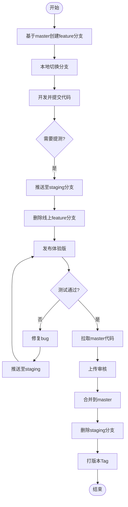

# 分支管理

## 线上分支模型

- `master`: 主分支，稳定代码，对应线上正式版，长期存在，禁止本地 push，需要再coding提合并请求
- `feature/*`: 功能开发分支，开发协同，提测后删除
- `staging/*`: 测试分支，发布后删除
- `hotfix/*`: 热修复分支，提测后删除，可以只在本地创建，不推送到线上

## 工作流程

### 功能开发

#### 开发前

1. 基于`master`分支创建线上功能分支，如`feature/a`

```bash
git pull origin master
git switch -c feature/a
git push origin feature/a
```

#### 开发中

1. 本地切新分支

```bash
# 当前处于 mater 分支
git switch -c feature/a
```

2. 提交本地 commit 到远程分支

```bash 
# feature/a 分支
git push origin feature/a
```

#### 提测

1. 提交测试分支

```bash
# 确保本地代码最新
git pull origin feature/a
git push origin feature/a:staging/a
```

2. 删除功能分支，测试阶段bug修复直接提交测试分支

```bash
git push origin :feature/a
```

3. 发布体验版

4. 在功能分支修复bug后，提交测试分支继续测试

```bash
git commit -m 'bug fixed'
git push origin feature/a:staging/a
```

#### 发布

1. 本地拉取master分支
2. 开发工具上传代码，并在管理后台提交审核
3. 审核通过后，合并测试分支到`master`分支，在coding提交合并请求
4. 删除测试分支（提交和并请求时勾选删除源分支）
5. 标记版本tag


#### 流程图



### 热修复

#### 开发

1. 本地基于`master`分支创建新热修复分支，如`hotfix/a`

```bash
git pull origin master
git switch -c hotfix/a
```

2. [可选] 推送到线上热修复分支

```bash
git push origin hotfix/a
```

#### 提测

- 需要测试

  - 如果需要提测，推送到测试分支，如`staging/a`

    ```bash
    git push origin staging/a
    ```

- 如果不需要测试

  1. 开发工具上传代码，并在管理后台提交审核
  2. 审核通过后，合并测试分支到`master`分支，在coding提交合并请求
  3. 删除测试分支（提交和并请求时勾选删除源分支）
  4. 标记版本tag


## 规范

### 分支命名规范

1. `master`：生产环境代码，仅允许通过合并请求更新。
2. 功能分支
   1. 格式：`feature/[功能描述]`
   2. 开发新功能时创建，合并到`staging/[功能描述]`后删除
3. 热修复分支
   1. 格式：`hotfix/[问题描述]`
   2. 紧急修复生产环境问题，直接基于`master`分支创建
   3. 如果需要提测，合并到`staging/[问题描述]`分支后删除
   4. 如果不需要提测，发起合并请求合并到`master`分支后删除
4. 测试分支（体验版）
   1. 格式：`staging/[功能/问题描述]`
   2. 用于发布体验版测试
   3. 测试通过后，发起合并请求合并到`master`分支后删除

### 提交信息规范

- 格式

  ```
  <类型>[可选范围]: <描述>
  [空行]
  [正文]
  [空行]
  [关联的coding id]
  ```

  注：`[]`中为可选内容

- 常见类型

  - `feat`：新增功能
  - `fix`：修复问题
  - `doc`：文档更新
  - `style`：代码格式（空格、分号等，不影响逻辑）
  - `chore`：构建或工具链更新

- 示例

  ```
  feat(login): add OAuth2 support for Google login
  
  - Implement Google OAuth2 API integration
  - Update login page UI
  
  Closes #123
  ```

### 其他

- `.gitignore`：忽略临时文件（如 node_modules/, *.log）。
- 原子化提交：一个提交只做一件事（如修复一个 Bug 或新增一个功能）。
- 标签（Tag）：发布版本时打标签（如 v1.0.0），附注说明变更内容。